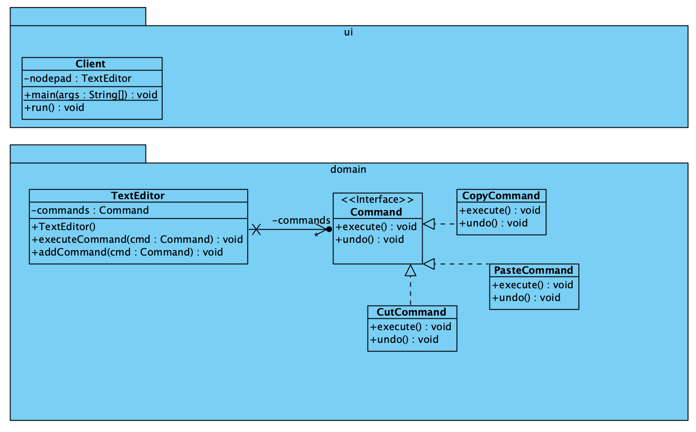

# Command Pattern

[Command Pattern](https://refactoring.guru/design-patterns/command)
is een behavioral pattern dat verzoeken omzet in zelfstandige objecten met
alle benodigde informatie, waardoor het mogelijk is om verzoeken door te geven,
uitvoering uit te stellen, in een wachtrij te plaatsen en bewerkingen ongedaan
te maken.

## UML

