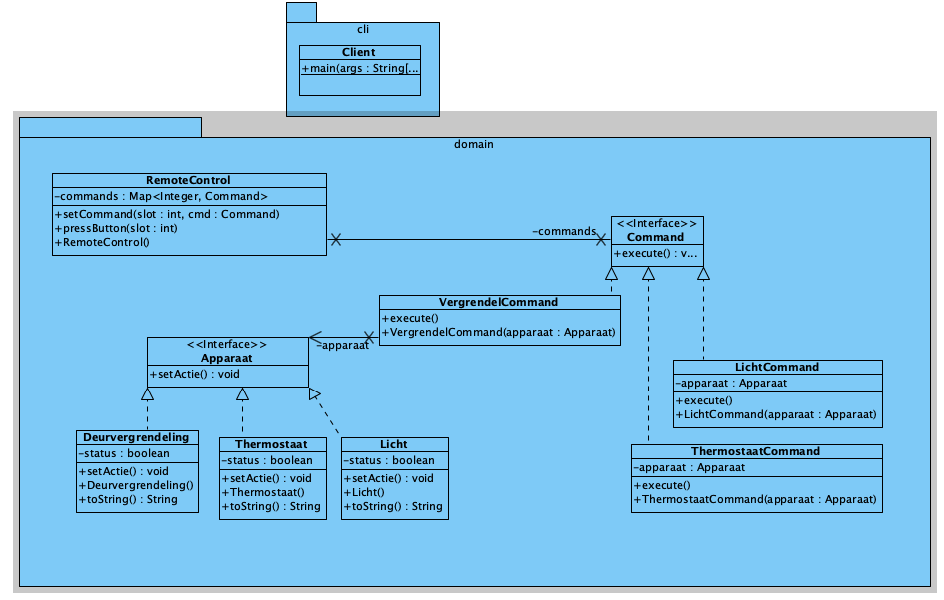

# Command Pattern

[Command Pattern](https://refactoring.guru/design-patterns/command)
is een behavioral pattern dat verzoeken omzet in zelfstandige objecten met
alle benodigde informatie, waardoor het mogelijk is om verzoeken door te geven,
uitvoering uit te stellen, in een wachtrij te plaatsen en bewerkingen ongedaan
te maken.

## UML

## Opgave:  Bouw een Smart Home Systeem

**Context:**
Je werkt aan een smart home systeem waar verschillende apparaten (zoals lichten, deurvergrendelingen, en thermostaten) kunnen worden bediend via een centrale afstandsbediening. Deze afstandsbediening moet verschillende commando's kunnen uitvoeren zoals het in- en uitschakelen van apparaten, het verhogen en verlagen van de temperatuur, en het vergrendelen of ontgrendelen van deuren.

**Doel:**
Implementeer het Command Pattern om deze functionaliteit te structureren. Zorg ervoor dat je een flexibele en uitbreidbare oplossing hebt waarbij nieuwe apparaten en commando's eenvoudig kunnen worden toegevoegd zonder de bestaande code significant te wijzigen.

**Vereisten:**

1. **Apparaten:**
   - Maak klassen voor ten minste drie verschillende apparaten: Licht, Deurvergrendeling, en Thermostaat.
   - Elk apparaat moet minimaal twee acties kunnen uitvoeren (bijv. Licht: aan/uit, Deurvergrendeling: vergrendelen/ontgrendelen, Thermostaat: temperatuur verhogen/verlagen).

2. **Command Interface:**
   - Definieer een `Command` interface met een methode `execute()`.

3. **Concrete Commands:**
   - Implementeer concrete commando's voor de acties van elk apparaat. Elk commando moet een referentie naar het bijbehorende apparaat hebben en de specifieke actie uitvoeren wanneer `execute()` wordt aangeroepen.

4. **Invoker:**
   - Maak een klasse voor de afstandsbediening (`RemoteControl`). Deze klasse moet knoppen hebben die aan verschillende commando's kunnen worden toegewezen. Denk aan methoden zoals `setCommand(int slot, Command command)` en `pressButton(int slot)`.

5. **Client:**
   - In je hoofdprogramma (`main` methode), creëer instanties van de apparaten en commando's, wijs de commando's toe aan de knoppen van de afstandsbediening en demonstreer de werking door verschillende knoppen in te drukken.

**Aanvullende Opties:**

- Implementeer een "undo" functionaliteit voor de afstandsbediening zodat de laatste actie ongedaan kan worden gemaakt.
- Voeg meer apparaten en commando's toe om de flexibiliteit van je ontwerp te demonstreren.
