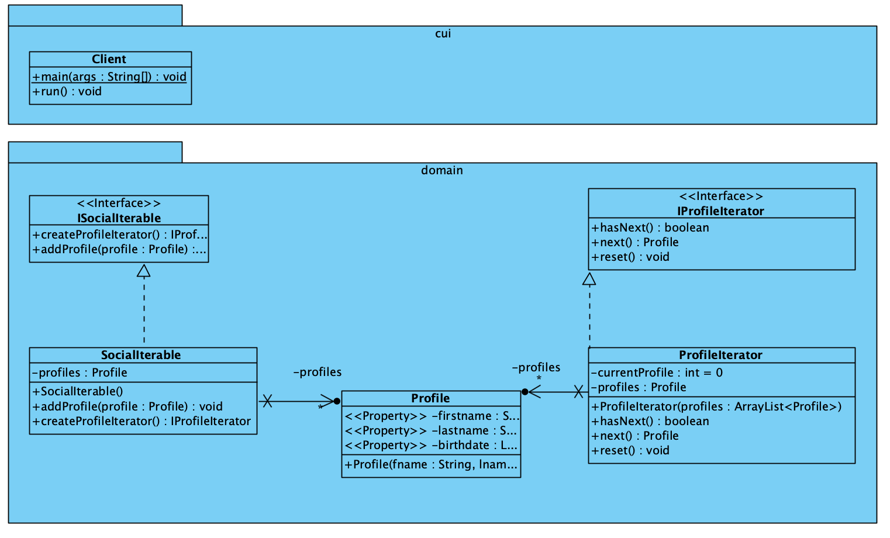

# Iterator Pattern

[Iterator Pattern](https://refactoring.guru/design-patterns/iterator)
is een behavioral pattern waarmee je elementen van een verzameling
kunt doorlopen, zonder de onderliggende represenatie.

## UML

