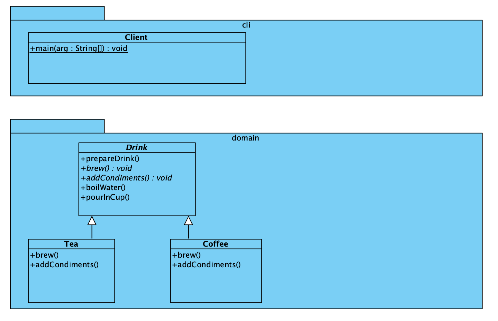

# Template Method Pattern

[Template Method Pattern](https://refactoring.guru/design-patterns/template-method)
is een behavioral pattern dat een algoritme definieert in de superklasse,
waarbij subklassen specifieke stappen kunnen overschrijven zonder de
structuur te wijzigen.

## UML

