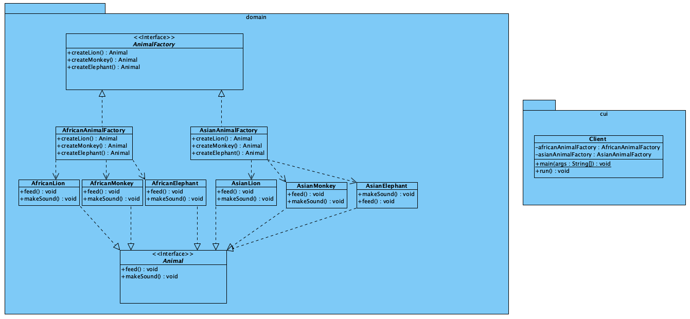

# Abstract Factory Pattern

[Abstract Factory Pattern](https://refactoring.guru/design-patterns/abstract-factory) is een creational
pattern voorziet in een interface voor het prodceren
van een reeks gerelateerde of afhankelijke objecten,
zonder de specifieke klassen ervan te specificeren.

## UML

