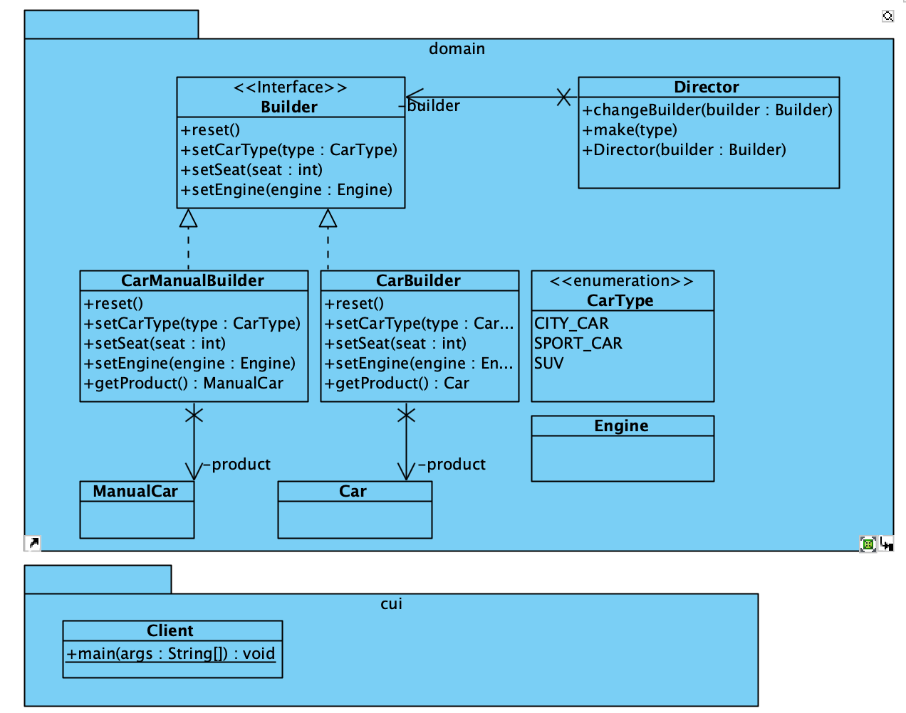

# Builder Pattern

[Builder Pattern](https://refactoring.guru/design-patterns/builder) is een creational pattern waarmee je stap voor stap complexe objecten kunt maken. Hierdoor kun je verschillende types en representaties van een object maken met dezelfde constructiecode.

## UML

