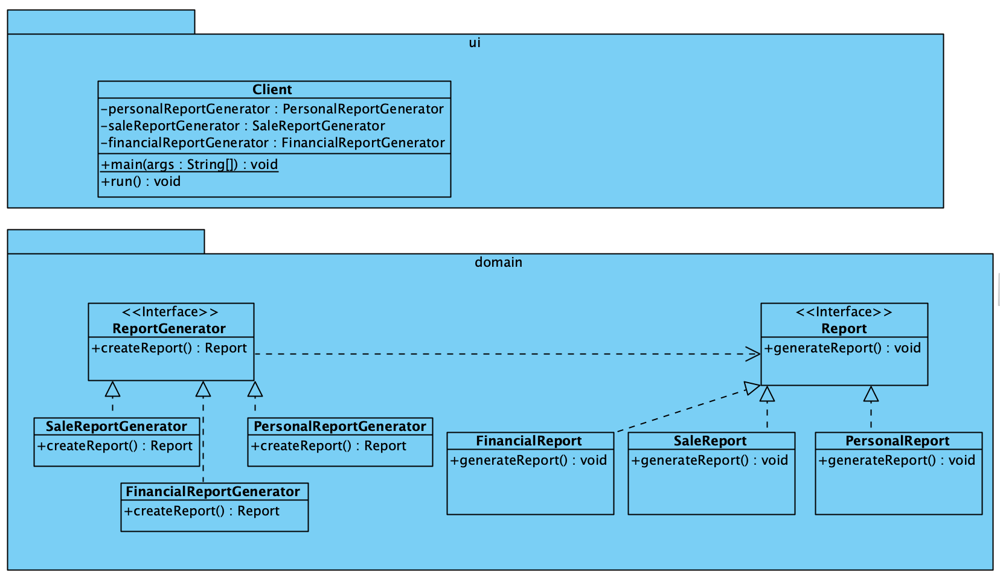

# Factory Method Pattern

[Factory Method Pattern](https://refactoring.guru/design-patterns/factory-method) is een creational pattern dat een interface biedt
voor het maken van objecten. Subklassen bepalen welke klasse ze instantieren, wat losse koppeling tussen klassen en code hergebruik
bevordert.

## UML

