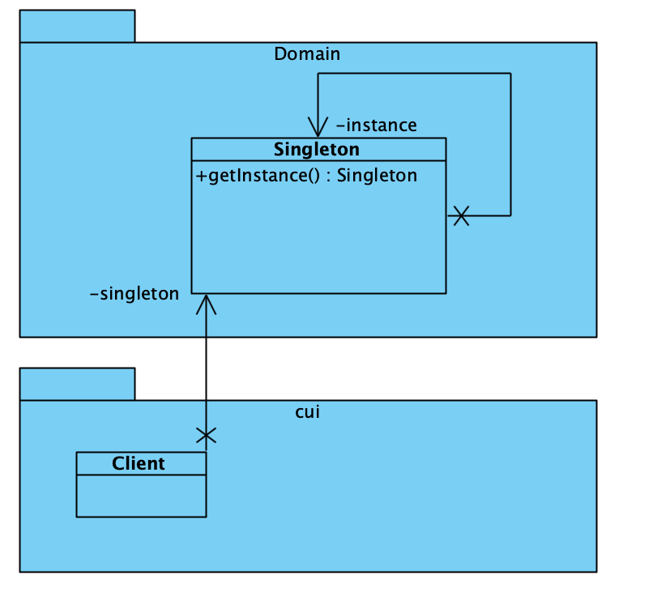

# Singleton Pattern

[Singleton Pattern](https://refactoring.guru/design-patterns/singleton) is een creational pattern waarmee je ervoor
kunt zorgen dat een klasse juist één instantie heeft, terwijl je een globaal toegangspunt tot deze instantie hebt.

## UML

