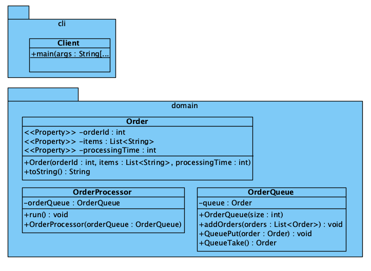

# Opgave: Bestellingen Verwerken met Multithreading

Je bent verantwoordelijk voor de ontwikkeling van een applicatie die bestellingen verwerkt voor een online winkel. De bestellingen komen binnen in een wachtrij en moeten worden verwerkt door meerdere threads om de verwerkingstijd te verkorten. Elke bestelling bevat informatie zoals een bestelnummer en de artikelen die besteld zijn. Je moet een multithreaded programma schrijven dat de bestellingen uit de wachtrij haalt en verwerkt.

## Specificaties

1. **Bestelklasse (`Order`)**
   - Maak een klasse `Order` met de volgende velden:
     - `orderId` (int): Het unieke bestelnummer.
     - `items` (List\<String>): Een lijst van artikelen in de bestelling.
     - `processingTime` (int): De tijd in milliseconden die nodig is om de bestelling te verwerken.

2. **Wachtrij van Bestellingen (`OrderQueue`)**
   - Maak een thread-safe wachtrij voor de bestellingen (`OrderQueue`).
   - Gebruik een geschikte datastructuur om de thread-safety te garanderen (bijv. `BlockingQueue`).

3. **Bestelverwerker (`OrderProcessor`)**
   - Maak een klasse `OrderProcessor` die een `Runnable` implementeert.
   - Deze klasse moet bestellingen uit de wachtrij halen en de bestellingen verwerken door een simulatie van de verwerkingstijd (`Thread.sleep` op basis van `processingTime`).
   - Log het bestelnummer en de verwerkte artikelen zodra de bestelling is verwerkt.

4. **Hoofdpogramma (`Main`)**
   - Maak een hoofdpogramma dat:
     - Een wachtrij van bestellingen vult met 10 voorbeeldbestellingen.
     - Drie `OrderProcessor` threads start om de bestellingen parallel te verwerken.
     - Zorgt dat het programma wacht totdat alle bestellingen zijn verwerkt voordat het afsluit.

## Randvoorwaarden

- Zorg ervoor dat je programma thread-safe is.
- De volgorde van de bestellingen moet behouden blijven zoals ze in de wachtrij zijn geplaatst.
- Gebruik logica om ervoor te zorgen dat alle bestellingen uiteindelijk worden verwerkt, zelfs als er meer bestellingen zijn dan de beschikbare threads.

## UML

