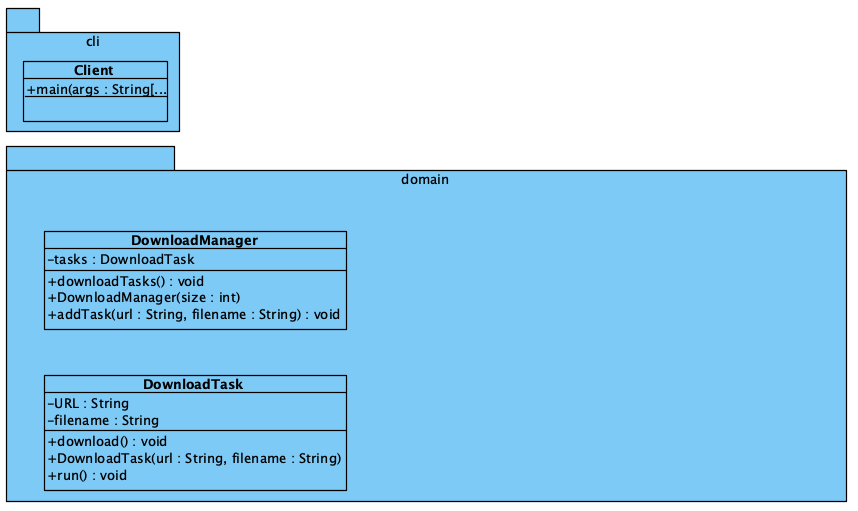

# Opgave: Concurrent Download Manager

Je taak is om een eenvoudige download manager te implementeren die meerdere bestanden parallel kan downloaden vanaf verschillende URLs. Elke downloadtaak moet worden uitgevoerd in een aparte thread om gelijktijdige downloads mogelijk te maken.

## Specificaties

1. **Downloadtaak (`DownloadTask`)**:
   - Maak een klasse `DownloadTask` die een bestand kan downloaden vanaf een specifieke URL.
   - Implementeer de logica om de download uit te voeren in een aparte thread.
   - Gebruik `java.net.URL` en `java.io.InputStream` om de download uit te voeren.

2. **Download Manager (`DownloadManager`)**:
   - Maak een klasse `DownloadManager` die verantwoordelijk is voor het beheren van downloadtaken.
   - De `DownloadManager` moet een lijst van downloadtaken bijhouden en elke taak starten in een aparte thread.
   - Zorg ervoor dat de `DownloadManager` het downloaden van bestanden kan starten, pauzeren, hervatten en annuleren.

3. **Hoofdprogramma (`Main`)**:
   - Schrijf een hoofdprogramma dat een lijst van URLs en bestandsnamen bevat die moeten worden gedownload.
   - Maak een instantie van `DownloadManager` en voeg downloadtaken toe voor elke URL.
   - Start het downloaden en zorg ervoor dat het programma wacht totdat alle downloads zijn voltooid voordat het afsluit.

## Randvoorwaarden

- Zorg ervoor dat je programma thread-safe is, vooral bij het beheren van gedeelde bronnen zoals de lijst van downloadtaken.
- Implementeer robuuste foutafhandeling om te gaan met netwerkproblemen, ongeldige URLs, enzovoort.
- Overweeg om de downloadsnelheid te beheren door gebruik te maken van limieten voor het aantal gelijktijdige downloads.
- Gebruik Java's standaardbibliotheek voor netwerken en bestandsbewerkingen.

## UML

