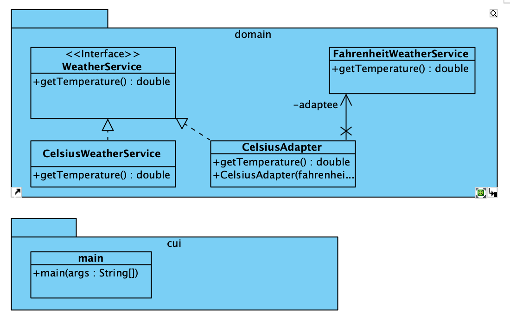

# (Object) Adapter Pattern

[(Object) Adapter Pattern](https://refactoring.guru/design-patterns/adapter) is
een structural pattern converteert de interface van een klasse naar een andere
interface, waardoor klasse met niet combineerbare interfaces kunnen samenwerken

## UML

