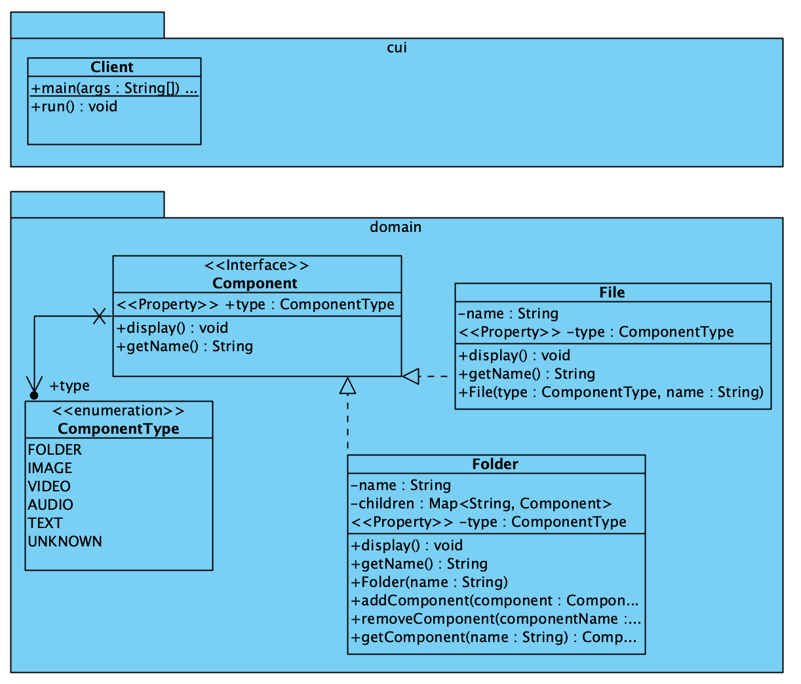

# Composite Pattern

[Composite Pattern](https://refactoring.guru/design-patterns/composite) is
een structural pattern waarmee je objecten kunt samenvoegen tot boomstructuren en vervolgens met deze structuren kunt werken alsof het individuele objecten zijn.

## UML

