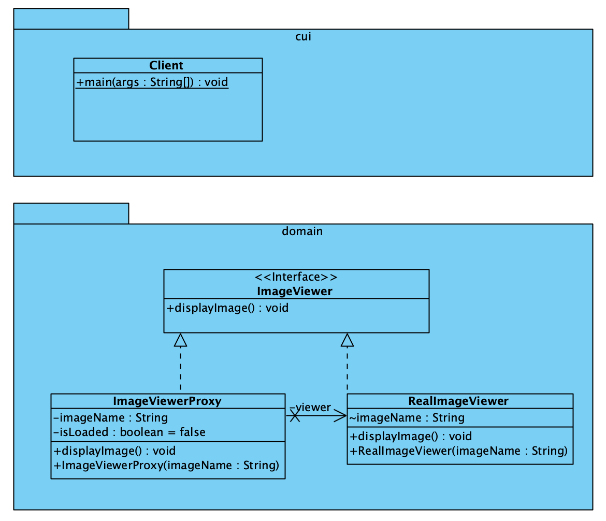

# Proxy Pattern

[Proxy Pattern](https://refactoring.guru/design-patterns/proxy) is een
structural pattern dat werkt als een vervanger voor een ander object, waarbij
acties worden gecontroleerd en mogelijk uitgevoerd voor of na toegang tot
het oorspronkelijke object.

## Andere oefeningen

[Proxy Pattern Beveiligd bestand](../ProxyPattern_BeveiligdBestandslees/README.md)

## UML

