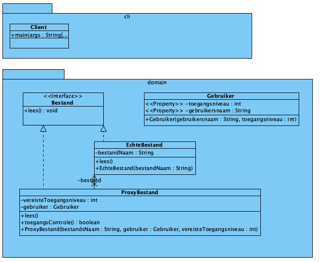

# Proxy Pattern

[Proxy Pattern](https://refactoring.guru/design-patterns/proxy) is een
structural pattern dat werkt als een vervanger voor een ander object, waarbij
acties worden gecontroleerd en mogelijk uitgevoerd voor of na toegang tot
het oorspronkelijke object.

## UML

## Opgave: Implementatie van een Beveiligd Bestandslees Systeem

**Context:**
Je werkt aan een systeem waar gebruikers toegang moeten krijgen tot bepaalde bestanden. Het is belangrijk om de toegang te beveiligen zodat alleen geautoriseerde gebruikers bepaalde bestanden kunnen lezen. Je wilt hiervoor het Proxy Pattern gebruiken om de beveiliging te implementeren.

**Doel:**
Implementeer het Proxy Pattern om toegang tot bestanden te beveiligen. De proxy moet controleren of de gebruiker geautoriseerd is voordat toegang tot het daadwerkelijke bestand wordt verleend.

**Vereisten:**

1. **Bestand Interface:**
   - Definieer een `Bestand` interface met een methode `lees()`.

2. **Echt Bestand:**
   - Implementeer een concrete klasse `EchtBestand` die de `Bestand` interface implementeert. Deze klasse moet de daadwerkelijke bestandstoegang simuleren door bijvoorbeeld de bestandsinhoud naar de console te printen.

3. **Proxy Bestand:**
   - Implementeer een `ProxyBestand` klasse die de `Bestand` interface implementeert. Deze klasse moet controleren of de gebruiker geautoriseerd is voordat de `lees()` methode van `EchtBestand` wordt aangeroepen.

4. **Gebruiker:**
   - Maak een `Gebruiker` klasse met attributen zoals gebruikersnaam en toegangsniveau.

5. **Toegangscontrole:**
   - Implementeer een eenvoudige toegangscontrolemechanisme in de `ProxyBestand` klasse. Bijvoorbeeld, alleen gebruikers met een bepaald toegangsniveau mogen het bestand lezen.

6. **Client:**
   - Maak een `Client` klasse waarin je een aantal gebruikers aanmaakt en probeert bestanden te lezen via de proxy.

**Aanvullende Opties:**

- Voeg logging toe aan de proxy zodat elke poging tot toegang wordt gelogd.
- Implementeer caching in de proxy zodat herhaalde leesacties sneller kunnen worden uitgevoerd.
